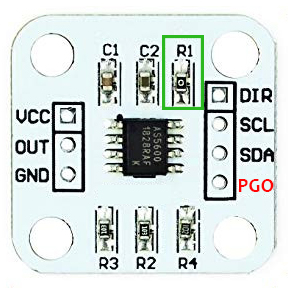
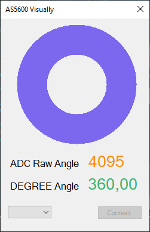
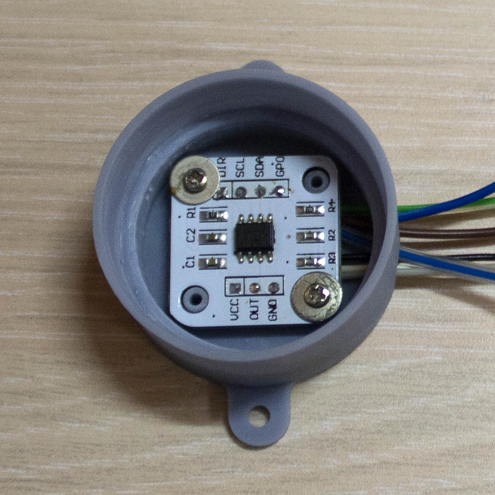
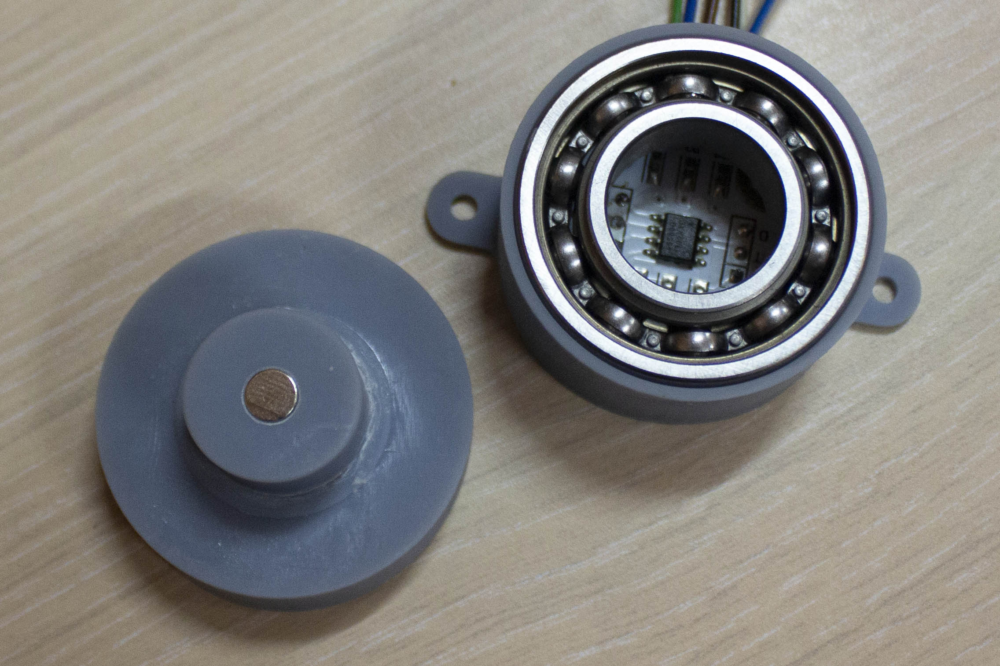
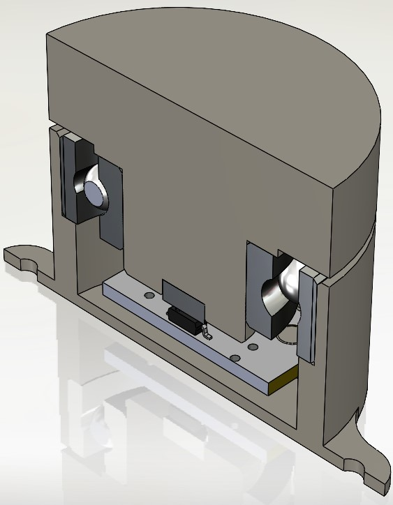

# AMS-AS5600-Arduino-Library

## Описание
Наиболее полная и удобная библиотека Arduino для работы с магнитным датчиком положения AS5600

## Особенности
* Полная поддержка всех функций датчика
* Работает со стандартным объектом **Wire**
* Поддержка на множестве платформ: *STM32, AVR, ESP32 ...*
* Имеет методы с верифкацией (проверкой)
* [3D-модель](addons/AS5600-Case-STL/) кейса для тестов
* Имеет несколько встроенных [примеров](examples/): *упрвление громкостью, [приложение AS5600 Visually](addons/AS5600-Visually/), вывод значений на дисплей SSD1306, HTML-страница ...*

## AS5600 Visually
* Позволяет наблюдать за положением магнита, принимая данные из COM-Port

## Изображения

## Ссылки
* [Даташит AS5600](https://ams.com/documents/20143/36005/AS5600_DS000365_5-00.pdf)
* [Страница AS5600](https://ams.com/en/as5600)
* [Ядро Роджера](https://github.com/rogerclarkmelbourne/Arduino_STM32)
* [Ядро официальное](https://github.com/stm32duino/Arduino_Core_STM32)
